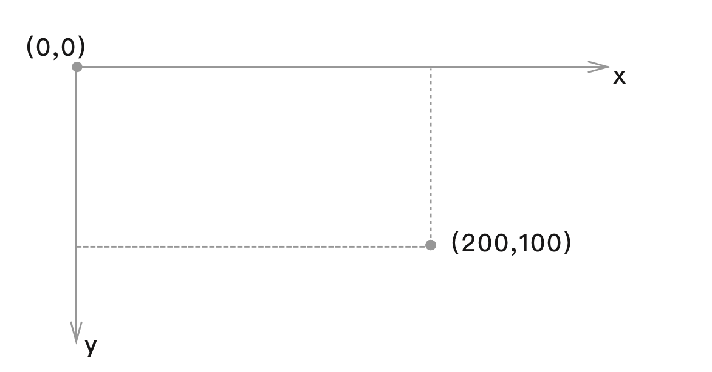
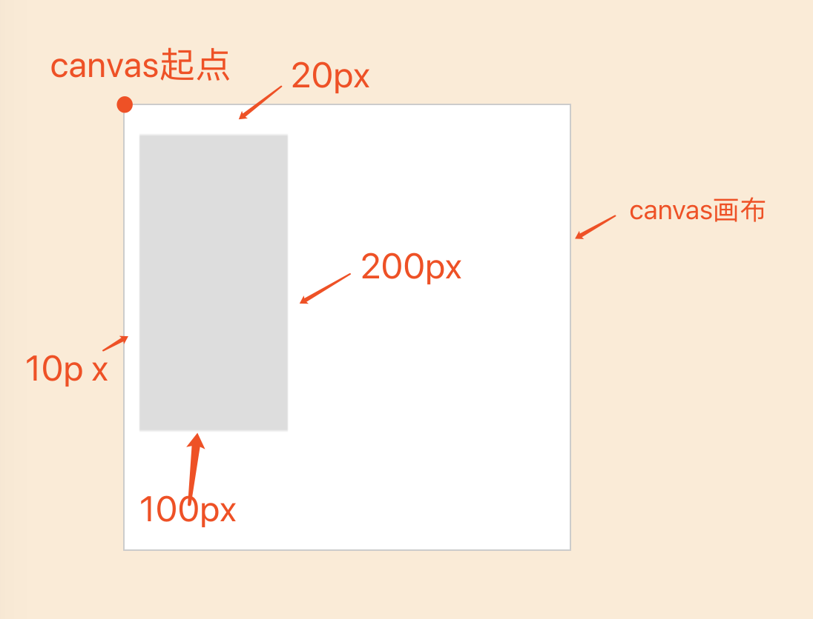
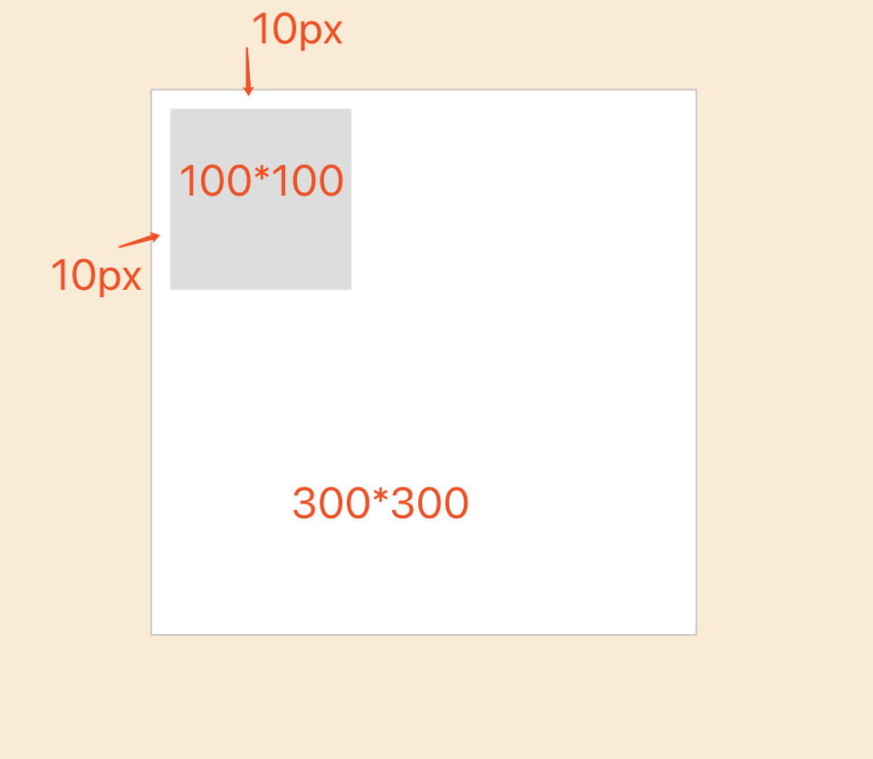
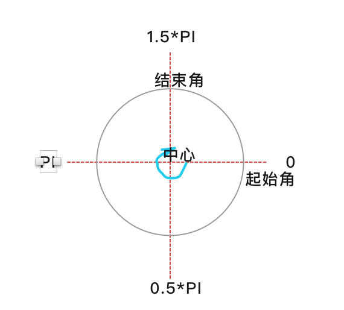
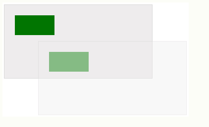
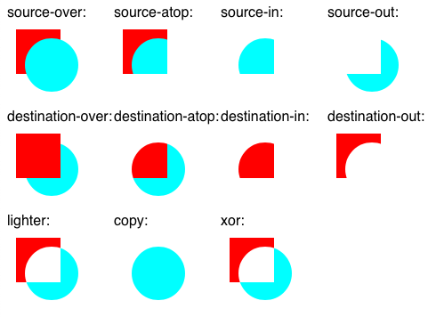

2Canvas

## 一.说明

Canvas是HTML5新增的组件，像一块幕布画板，可使用JavaScript在上面绘制各种图表、动画等。

##### 1.标签

```html
<canvas id="canvas-item"></canvas>
```

**\* canvas默认大小为300 X 150**

##### 2.不支持说明

```html
<canvas id="canvas-item">
	<p>
        您的浏览器不支持canvas
    </p>
</canvas>
```

与iframe类似，当浏览器不支持canvas时，将显示“不支持canvas”的提示。否则则显示canvas画布。

也可利用`canvas.getContext`来测试浏览器是否支持Canvas

```javascript
var canvas = Document.getElementById('canvas-item');
if(canvas.getContext){
    //支持Canvas
}else{
    //不支持Canvas
}
```

##### 3.绘制说明

getContext() 方法可返回一个对象，该对象提供了用于在画布上绘图的方法和属性。

##### 4. 2D坐标说明

绘制canvas 2D图像，需要使用对CanvasRenderingContext2D 这个对象进行操作。

```javascript
var ctx = canvas.getContext('2d');

//绘制3D需使用webgl
// var gl = canvas.getContext('webgl');
```

(0,0)坐标点位于画布左上角，水平向右为x轴，垂直向下为y轴，画布中所有点都为非负整数。



##### 5.画布大小特别说明

**画布默认大小为300\*150**，修改画布大小，只能使用**属性**修改，即在html标签中修改。

在css中修改画布大小时，相当于对画布进行拉伸。

例如，css设置画布大小为300*300，相当于将画布的y方向由150px拉伸为300px，此时在画布上的1px实际显示2px的高度。

```javascript
var canvas = document.getElementById('canvas-item')
var ctx = canvas.getContext('2d'); //创建CanvasRenderingContext2D对象
ctx.fillStyle = '#999999'; //  设置填充颜色
ctx.fillRect(10,10,100,100); // 以(10,10)为起点，绘制长宽为100的正方形
```

实际显示：




**正确修改画布大小方式**

```html
<canvas id="canvas-item" width="300" height="300"></canvas>
```

实际显示



##### 6.浏览器支持说明

* IE 9.0
* Chrome 4.0
* FireFox 2.0
* Safari 3.1
* Opera 9.0

## 二. 属性    getContext("2d") 

### 1.颜色、样式、阴影

| 属性          | 描述                                                         |
| ------------- | ------------------------------------------------------------ |
| fillStyle     | 设置或返回用于填充绘画的颜色、渐变、模式(color \| gradient \| pattern) |
| strokeStyle   | 设置或返回用于笔触的颜色、渐变、模式(color \| gradient \| pattern) |
| shadowColor   | 设置或返回用于阴影的颜色                                     |
| shadowBlur    | 设置或返回用于阴影的模糊级别                                 |
| shadowOffsetX | 设置或返回阴影距形状的水平距离                               |
| shadowOffsetY | 设置或返回阴影距形状的垂直距离                               |

| 方法                   | 描述                                |
| ---------------------- | ----------------------------------- |
| createLinearGradient() | 创建先行渐变（用在画布内容上）      |
| createPattern()        | 在指定的方向上重复指定的元素        |
| createRadialGradient() | 创建放射状/环形的渐变（用在画布上） |
| addColorStop()         | 规定渐变对象中的颜色和停止位置      |

```javascript
//context.fillStyle = color | gradient | pattern
//context.strokeStyle = color | gradient | pattern
//color:绘图填充色的颜色值,默认#000000
//gradient: 用于填充绘图的渐变对象（线性/放射性）
//pattern:用于填充绘图的pattern对象
```

### 2.线条样式

| 属性       | 描述                                     |
| ---------- | ---------------------------------------- |
| lineCap    | 设置或返回线条的结束端点样式             |
| lineJoin   | 设置或返回两条线相交时，所创建的拐角类型 |
| lineWidth  | 设置或返回当前的线条宽度                 |
| miterLimit | 设置或返回作答斜接长度                   |

```javascript
lineCap = butt | round | square
//butt:默认，向线条的每个末端添加平直的边缘
//round:向线条的末端添加圆形线帽
//square:向线条的末端添加正形线帽
//添加线帽后，线的长度增加“线的宽度”

lineJoin = bevel | round | miter
//bevel:创建斜角
//round:创建圆角
//miter:默认。创建尖角------受miterLimit属性影响
```

### 3.矩形

| 方法         | 描述                         |
| ------------ | ---------------------------- |
| rect()       | 创建矩形  ———  不绘制        |
| fillRect()   | 绘制“被填充”的矩形           |
| strokeRect() | 绘制“无填充”的矩形           |
| clearRect()  | 在给定的矩形内清除指定的像素 |

```javascript
//rect(x,y,width,height)  创建矩形，但不绘制。需要另外绘制
ctx.rect(20,20,150,100); 

//fillRect(x,y,width,height);  绘制填充的矩形,配合使用fillStyle
//先设置填充颜色，再绘制
ctx.fillRect(20,20,100,100);

//strokeRect(x,y,width,height);  绘制不填充的矩形,配合使用strokeStyle
//先设置填充颜色，再绘制
ctx.strokeRect(20,20,100,100);
```

### 4.路径

| 方法               | 描述                                                   |
| ------------------ | ------------------------------------------------------ |
| fill()             | 填充当前绘图（路径）                                   |
| stroke()           | 绘制已定义的路径                                       |
| beginPath()        | 起始一条路径，或重置当前路径                           |
| moveTo()           | 把路径移到画布指定的点，不创建线条                     |
| closePath()        | 创建从当前点回到起始点的路径                           |
| lineTo()           | 添加一个新点，然后在画布中创建从该点到最后指定点的线条 |
| clip()             | 从原始画布中剪切任意形状和尺寸的区域                   |
| quadraticCurveTo() | 创建二次贝塞尔曲线                                     |
| bezierCurveTo()    | 创建三次方贝塞尔曲线                                   |
| arc()              | 创建弧/曲线（用于圆）                                  |
| arcTo()            | 创建两切钱之前的弧/曲线                                |
| isPonitInInPath()  | 如果指定的点位于当前路径中，则返回true，否则返回false  |

**路径绘制使用stroke()**

```javascript
//创建矩形
ctx.rect(10,10,100,100);
//指定填充颜色，填充矩形
ctx.fillStyle = '#f00';
ctx.fill();
//指定绘制颜色，绘制矩形边框
ctx.strokeStyle = '#f0f';
ctx.stroke();


//beginPath(); 开始一条新的路径，使接下来绘制的路径不受之前设置的影响。
//moveTo(x,y);  移动到（x,y）点，不绘制路径
//lineTo(x,y); 从起始点画线至（x,y）点

//clip(), 从画布中剪切形状，剪切后，绘图会被限制在剪切区域中。（不能访问画布上其他位置）
//可以在使用clip()前使用save()方法，对当前画布区域进行保存，应在以后的任意时间对其进行恢复(restore())

//quadraticCurveTo(xc1,yc1,x,y)
//xc1,yc1:控制点
//x,y结束点
ctx.beginPath();
ctx.moveTo(20,20);
ctx.quadraticCurveTo(20,100,200,20);

//bezierCurveTo(xc1,yc1,xc2,yc2,x,y)
//xc1,yc1:控制点1
//xc2,yc2:控制点2
//x,y结束点
ctx.beginPath();
ctx.moveTo(20,20);
ctx.bezierCurveTo(20,100,200,100,200,20);

//arc(x,y,r,startAngule,endAngule,[counterclockwise])
//x,y:原点坐标
//r:半径
//startAngule: 起始角度
//endAngule: 结束角度
//counterclockwise：逆时针绘制  false:顺时针  true:逆时针
context.arc(100,100,30,0,1/2*Math.PI,false);

//arcTo(x1,y1,x2,y2,r)   !!不太懂
//x1,y1弧起点
//x2,y2弧终点
//r: 弧半径


```

绘制圆弧：



### 5.转换

| 方法           | 描述                                          |
| -------------- | --------------------------------------------- |
| scale()        | 缩放                                          |
| rotate()       | 旋转                                          |
| translate()    | 重新映射画布上(0,0)的位置                     |
| transform()    | 替换绘图的当前转换矩阵                        |
| setTransform() | 将当前转换重置为单元矩阵，然后运行transform() |

```javascript
//缩放绘图，对缩放命令后的绘图会有缩放影响，对之前的绘图没有影响。
//缩放命令后再次执行缩放，会在上次缩放的基础上进行缩放。
scale(scaleWidth,scaleHeight)
scale(2,2)//x,y各缩放2倍
scale(2,2)//x,y再各缩放2倍，实际相对最初缩放4倍

//旋转绘图，旋转原点为画布的(0,0)点
rotate(angle)
//旋转角度以弧度计。
//弧度计算公式：degrees*Math.PI/180

//移动画布,重新映射画布上的 (0,0) 位置。
translate(x,y)

//transform(a,b,c,d,e,f,g),缩放、旋转、移动并倾斜当前的环境。   ！！ 不懂
//该变换只会影响 transform() 方法调用之后的绘图，多次调用，以上次调用的为基础进行变换
//transform() 方法的行为相对于由 rotate(), scale(), translate(), or transform() 完成的其他变换
//a	水平缩放绘图
//b	水平倾斜绘图
//c	垂直倾斜绘图
//d	垂直缩放绘图
//e	水平移动绘图
//f	垂直移动绘图

//setTransform()  重置并重建变换矩阵
//该变化会影响setTransform() 方法调用之后的绘图，多次调用以最初的为基础进行变换


```

translate图解：



### 6.文本

| 属性         | 描述                                     |
| ------------ | ---------------------------------------- |
| font         | 设置或返回文本内容的当前字体属性         |
| textAlign    | 设置或返回文本内容的当前对齐方式         |
| textBaseline | 设置或返回在绘制文本时使用的当前文本基线 |

| 方法          | 描述                       |
| ------------- | -------------------------- |
| fillText()    | 在画布上绘制“被填充的”文本 |
| strokeText()  | 在画布上绘制文本（无填充） |
| measureText() | 返回包含指定文本宽度的对象 |

```javascript
//font 具有与css font相同的属性，可设置font-style，font-variant,font-weight,font-size,line-height,font-family 等
font = "40px Arial"

//textAlign 置或返回文本内容的当前对齐方式
//配合使用fillText()，strokeText()方法
textAlign = "center | start | end | left | right "
//start	  默认。文本在指定的位置开始。
//end	  文本在指定的位置结束。
//center  文本的中心被放置在指定的位置。
//left	  文本左对齐。
//right	  文本右对齐。


//fillText(),strokeText()类似
ctx.textAlign="start";
ctx.fillText("textAlign=start",150,60);        
ctx.textAlign="end"; 
ctx.fillText("textAlign=end",150,80);                  
ctx.textAlign="left"; 
ctx.fillText("textAlign=left",150,100);
ctx.textAlign="center"; 
ctx.fillText("textAlign=center",150,120);              
ctx.textAlign="right";
ctx.fillText("textAlign=right",150,140);
```

### 7.图像绘制

| 方法        | 描述                         |
| ----------- | ---------------------------- |
| drawImage() | 向画布上绘制图像、画布、视频 |

 ```javascript
//在画布上定位图像
drawImage(img,x,y);

//在画布上定位图像，并规定图像的宽度和高度
drawImage(img,x,y,width,height)

//剪切图像，并在画布上定位被剪切的部分：
drawImage(img,sx,sy,swidth,sheight,x,y,width,height);

// img	规定要使用的图像、画布或视频。
// sx	可选。开始剪切的 x 坐标位置。
// sy	可选。开始剪切的 y 坐标位置。
// swidth	可选。被剪切图像的宽度。
// sheight	可选。被剪切图像的高度。
// x	在画布上放置图像的 x 坐标位置。
// y	在画布上放置图像的 y 坐标位置。
// width	可选。要使用的图像的宽度。（伸展或缩小图像）
// height	可选。要使用的图像的高度。（伸展或缩小图像）
 ```

### 8.像素操作

| 属性   | 描述                                            |
| ------ | ----------------------------------------------- |
| width  | 返回ImageData对象的宽度                         |
| height | 返回ImageData对象的高度                         |
| data   | 返回一个对象，包含指定的ImageData对象的图像数据 |

| 方法              | 描述                                                      |
| ----------------- | --------------------------------------------------------- |
| createImageDara() | 创建新的、空白的 ImageData 对象                           |
| getImageData()    | 返回 ImageData 对象，该对象为画布上指定的矩形复制像素数据 |
| putImageData()    | 把图像数据（从指定的 ImageData 对象）放回画布上           |

```javascript
//createImageData(),创建新的空白 ImageData 对象
/*
    对于 ImageData 对象中的每个像素，都存在着四方面的信息，即 RGBA 值：
    R - 红色 (0-255)
    G - 绿色 (0-255)
    B - 蓝色 (0-255)
    A - alpha 通道 (0-255; 0 是透明的，255 是完全可见的)
    因此 ，transparent black 表示 (0,0,0,0)
*/

//指定尺寸，创建存的ImageData对象
createImageData(width,height);
//创建一个与指定的另一个ImageData对象尺寸相同的新ImageData对象（不会复制图像数据）
createImageData(imageData);


//getImageData() 复制画布上指定矩形的像素数据
//putImageData() 将图像数据放置画布上

getImageData(x,y,width,height)
```

### 9.合成

| 属性                     | 描述                                   |
| ------------------------ | -------------------------------------- |
| globalAlpha              | 设置或返回绘图当前的alpha或透明值      |
| globalCompositeOperation | 设置或返回新图像如何绘制到已有的图像上 |

```javascript
//globalAlpha  设置绘制图形的透明度
globalAlpha=number;

//globalCompositeOperation  设置图层叠加方式
globalCompositeOperation = 'source-over'
//source-over  默认，在目标图层上方显示新图层
//source-atop  在目标图层顶部显示新图层。目标图层之外的新图层不可见   新图层位于之外的部分不可见
//source-in    在目标图层中显示新图层。只显示目标图层内的新图层，且目标图层透明
//source-out   在目标图层外显示新图层。不显示目标图层内的新图层，且目标图层透明
//destination-over  在新图层上方显示目标图层
//destination-ato  在新图层顶部显示目标图层。新图层之外的目标图层不可见
//destination-in  在新图层中显示目标图层。只显示新图层内的目标图层，且新图层透明
//destination-out  在新图层外显示目标图层。不显示新图层内的目标图层，且新图层透明
//lighter 显示新图层 + 目标图层
//copy 显示新图层，忽略目标图层
//xor 使用异或操作对新图层及目标图层进行组合
```



### 10.其他

| 方法          | 描述                                                     |
| ------------- | -------------------------------------------------------- |
| save()        | 保存当前环境的状态                                       |
| restore()     | 返回之前保存过的路径状态和属性                           |
| createEvent() |                                                          |
| getContext()  | 返回一个对象，该对象提供了用于在画布上绘图的方法和属性。 |
| toDataURL()   |                                                          |

