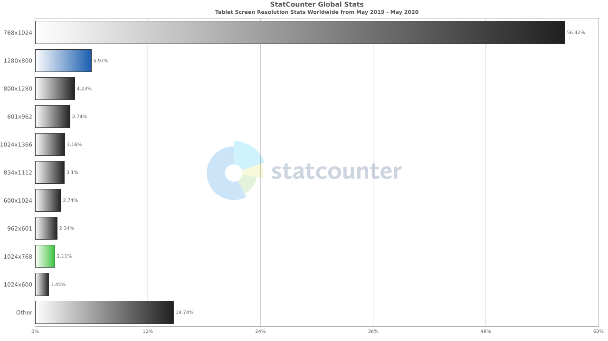

# 响应式布局

## 引言

响应式布局指的是同一页面在不同屏幕尺寸下显示不同的布局。

优点：

* PC端，手机端，Pad端等不同端只需要开发一套代码
* 面对不同分辨率设备灵活性强

缺点：

* CSS比较重
* 兼容各种设备工作量大，效率低下

> 响应式与自适应
>
> 响应式：开发一套界面，通过检测视口分辨率，针对不同客户端处理代码，显示不同的布局与样式
>
> 自适应：开发多套界面，通过检测视口分辨率，设备码等判断设备，向服务器请求设备对应页面

## 方案

### 1. 媒体查询

#### 1.1 确定分割点

简单区分来说，分为手机端，平板端，pc端

pc端再划分一下可以划分为笔记本电脑（小尺寸PC）及外接显示屏PC（超大屏）

根据屏幕尺寸占有率分布图，手机端，平板端，pc端屏幕尺寸占有率分布图




我们可以大致以750px，1024px，1600px作为屏幕分割点

**<750px 为手机端**[~,750]

**<1024px 为平板端**(750,1024]

**<1600 为PC端**(1024,1600)

**>1600 PC大屏**[1600,~]

当然，实际开发中可以根据实际情况增加新的分割点，以满足不同的需求

#### 1.2 设置优先样式

媒体查询中，max-width，min-width规定的范围都是**大于等于（小于等于）**，故而，后面的样式会覆盖前面的样式。

当手机端优先时，优先使用`min-width`,随着屏幕变大，调整样式覆盖手机端样式

当PC端优先时，优先使用`max-width`，随着屏幕缩小，调整样式覆盖PC端样式

```css
/*PC优先*/
{
    /*PC样式(1024,1600）*/
}
@media screen and (min-width: 1600px) {
    [1600,~]
}
@media screen and (max-width: 1024px) {
    (750,1024]
}
@media screen and (max-width: 750px) {
    [~,750]
}

/*手机端优先*/
{
    /*手机端样式[~,750]*/
}
@media screen and (min-width: 751px) {
    (750,1024]
}
@media screen and (min-width: 1025px) {
    (1024,1600)
}
@media screen and (min-width: 1600px) {
    [1600,~]
}
```

**\* 需要考虑分界点属于哪种样式**

不得不插一句，我更倾向于PC优先。大概是因为我做PC端的项目比较多。

### 2. 百分比布局

元素宽高单位设置为百分比，可有有效使得元素随浏览器宽高变换而变化，从而实现响应式布局。

**但是**，百分比是相对单位，在实际开发中，需要弄清是相对谁的百分比。

**height，width** 子元素的height、width是相对父元素的height、width

**top，left，bottom，right**，定位元素相对非定位父元素的宽、高

**padding，margin** 子元素相对父元素的**宽**，与高无关

**border-radius，translate，background-size** 相对自身宽高

**所以**，全局用百分比布局，自己会把自己绕晕

### 3. rem布局

**rem**也是相对单位，相对于根元素的font-size大小。

当根元素font-size大小变化时，以rem为单位规定尺寸的元素也会跟随变化。

故而~

需要js监测屏幕宽度变化，动态改写html font-size，实现响应式布局

rem单位换算   （16px = 1rem）

htmlFontSize =  fontSize * （clientWidth/UiWidth）

```js
function rem() {
  var UiWidth = 1366;  //UI设计图宽度
  var fontSize = 16;  //1rem = 16px
  var htmlEle = document.documentElement;
  var winWidth = htmlEle.clientWidth || document.body.clientWidth;
  var clientWidth = document.documentElement.clientWidth
  htmlEle.style.fontSize = fontSize *  (clientWidth/ UiWidth) + 'px';
};

windows.addEventListener(resizeEvt, rem, false);  //监测屏幕变化

document.addEventListener('DOMContentLoaded', rem, false); //文档加载完成，设置htm font-size
```

**结合媒体查询，效果更佳**

### 4. 视口单位  vw，vh

| 单位 | 含义                   |
| ---- | ---------------------- |
| vw   | 表示相对视图窗口的宽度 |
| vh   | 表示相对试图窗口的高度 |
| vmin | vw, vh中的较小值       |
| vmax | vmax: vw,vh中的较大值  |

100vw，100vh表示满屏

与%单位类似~~

**但是**，好用很多呀。。。

%，相对元素不确定

vh、vw，相对的视窗尺寸


当搭配rem，媒体查询使用时，也是非常香的，可以抛弃JS监听，使用vw来设置font-size。

比如根据ui的设计，

750px宽度的设计图，基准字号26px,

> 由于浏览器显示最小字号为12px，故在最小屏幕320px时，基准字号最小为12px
>
> 所以，手机端根元素字号变化范围为12~26px

1366px宽度的设计图，基准字号16px

> 同理，由于浏览器最小显示字号为12px，故平板端768px宽度，根元素字号应大于12px
>
> 所以大致设置下，每100px增减0.5px，768px宽度时，子元素字号大概13px

```css
html {
    font-size: 16px;
}
@media screen and (min-width: 1600px) {
    /*1366px宽度，基准字号16px，
      每增减加100px，字号增减0.5px
    */
    html {
        font-size: calc(100% + 5 * (100vw - 1366px) / 1000); //兼容Safari浏览器
        font-size: calc(16px + 5 * (100vw - 1366px) / 1000);
    }
}
@media screen and (max-width: 750px) {
    html {
        /* 750px宽度，基准字号26px
        	375px宽度,基准字号13px
        */
        font-size: calc(162.5% + (100vw - 750px) / 29);  //兼容Safari浏览器
        font-size: calc(26px + (100vw - 750px) / 29);
    }
}
```

诶。。怎么感觉划分两档就可以了.....

### 5. 图片处理

图片处理主要是两个方面：

	1. 保证图片在不同分辨率屏幕下不会被拉伸、压缩
 	2. 保证大屏的清晰度及加载速度

#### 5.1 随容器大小变化

```css
.img-wrap{
    display:flex;
    justify-content:center;
    align-items:center;
}
img{
    max-width:100%;
    max-height:100%
}
```

容器采用flex布局，保证图片居中显示。

限制图片最大宽度，最大高度，保障图片随容器自适应缩放。

#### 5.2 srcset , picture

```html

```

根据屏幕分辨率加载大图或小图

比如手机，mac dpi都达到2以上了，就加载大图，普通屏幕加载小图

即保证了高清屏的视觉体验，有不影响普通屏幕的加载速度。

**然而**，Mac的Chrome有丢丢问题，会加载两张图。。srcset 和src的图片都会加载一遍。。甚是奇怪

使用picture标签，没有上述问题

```html
<picture>
    <source srcset="img_w350.jpg" media="(max-width: 375px)">
    <srcset="img_w640.jpg" media="(max-width: 750px)">
    
</picture>
```

**然而**，不兼容ie...

#### 5.3 background-image

根据媒体查询放置不同大小尺寸的图片

或者设置background-size调整背景图片大小

```css
.banner{
  background-image: url(./large.jpg);
}

@media screen and (max-width: 750px){
  background-image: url(./small.jpg);
}
```

## 综上

没有哪种单一的方案能够解决响应式问题。。需要综合各个方案，取其优点，避其缺点

是不是感觉被骗了^_^

但是综合一下上面的解决方案~

我们可以选择  

>使用vw，vh, @media,动态配置根元素字号~使其平滑过渡（抛弃js监听，解耦css、js）
>
>然后利用rem动态设置元素尺寸
>
>再结合百分比，特殊处理图片尺寸

这样平板端和PC端多个尺寸可以平滑展示啦

手机端则特殊处理下尺寸问题

当然，布局利用下flex，grid布局，流式变化一下

**所以**，上述方案都要用。。。哈哈哈哈O(∩_∩)O

* 媒体查询分割临界点
* 结合vw，rem实现字体、尺寸适配
* 特殊处理图片响应式
* 结合flex，grid布局，动态适配


## 参考文档

https://www.zhangxinxu.com/wordpress/2016/08/vw-viewport-responsive-layout-typography

https://juejin.im/post/5caaa230e51d452b672f9703

